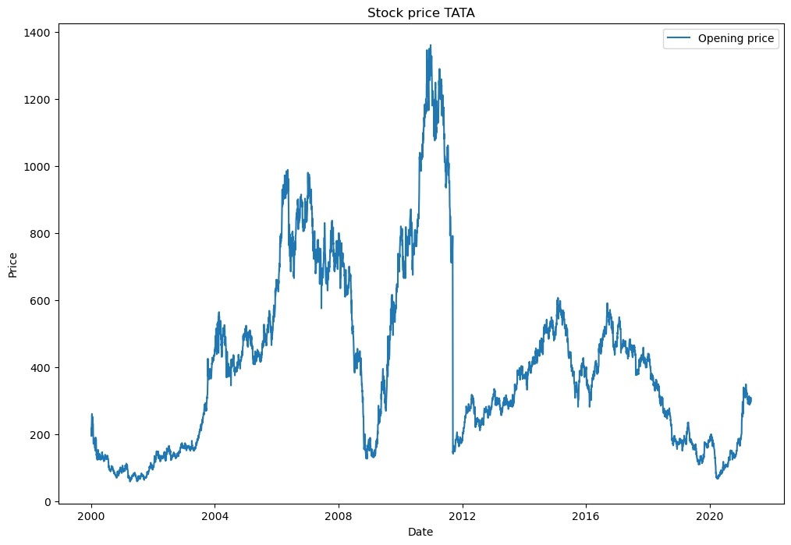
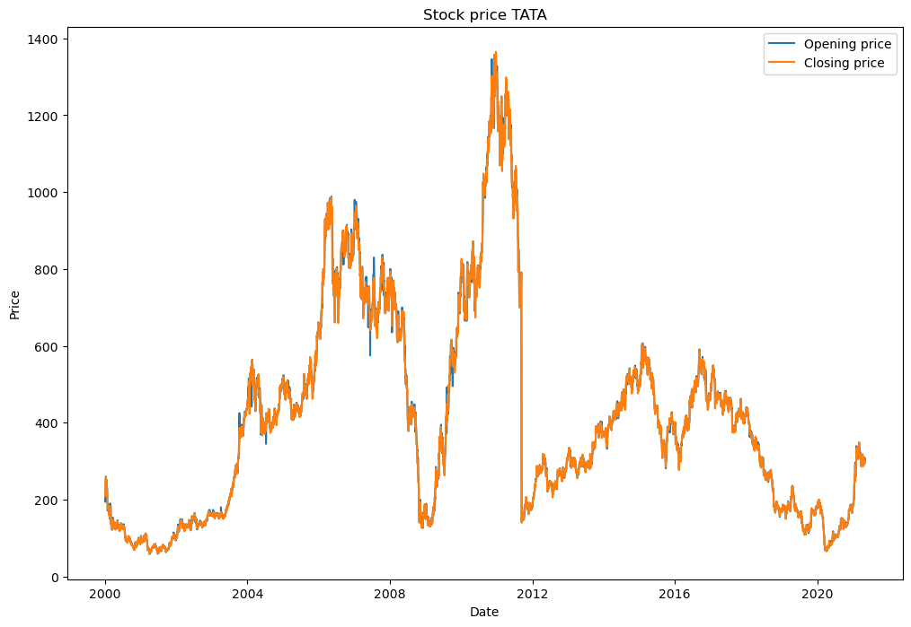
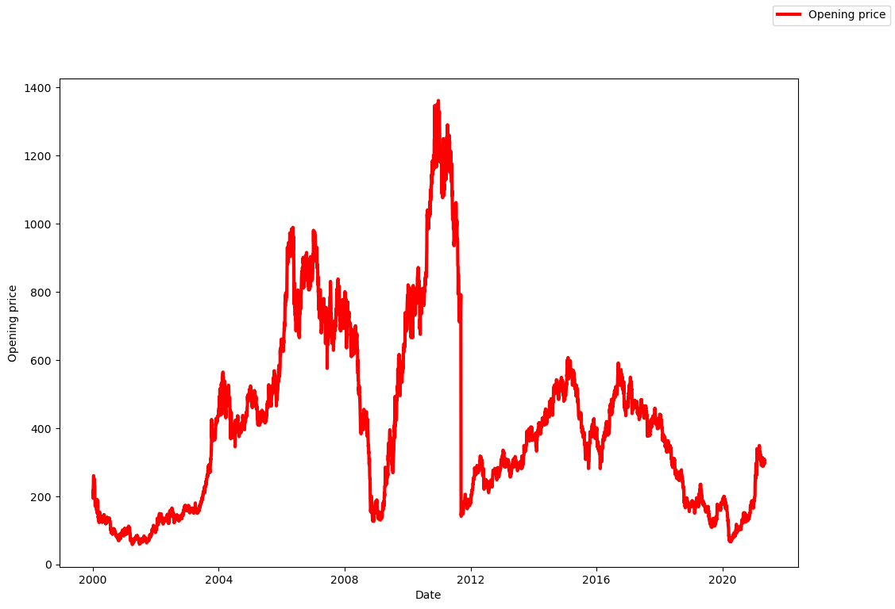
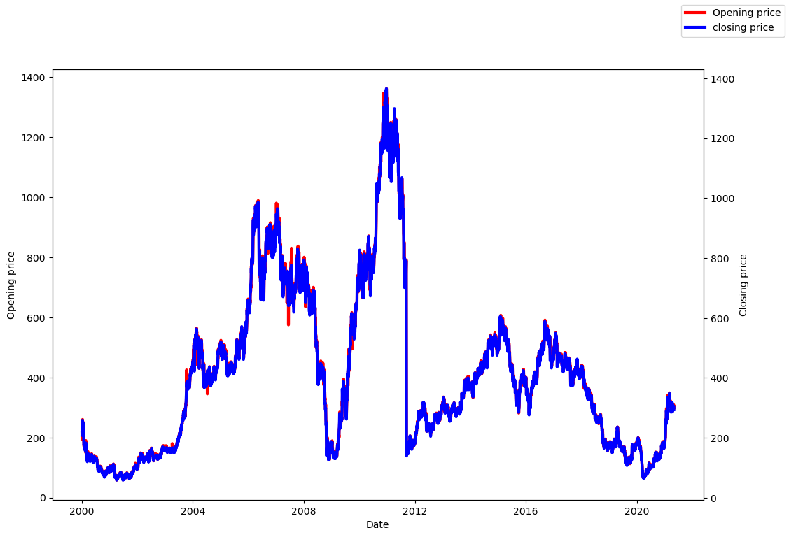
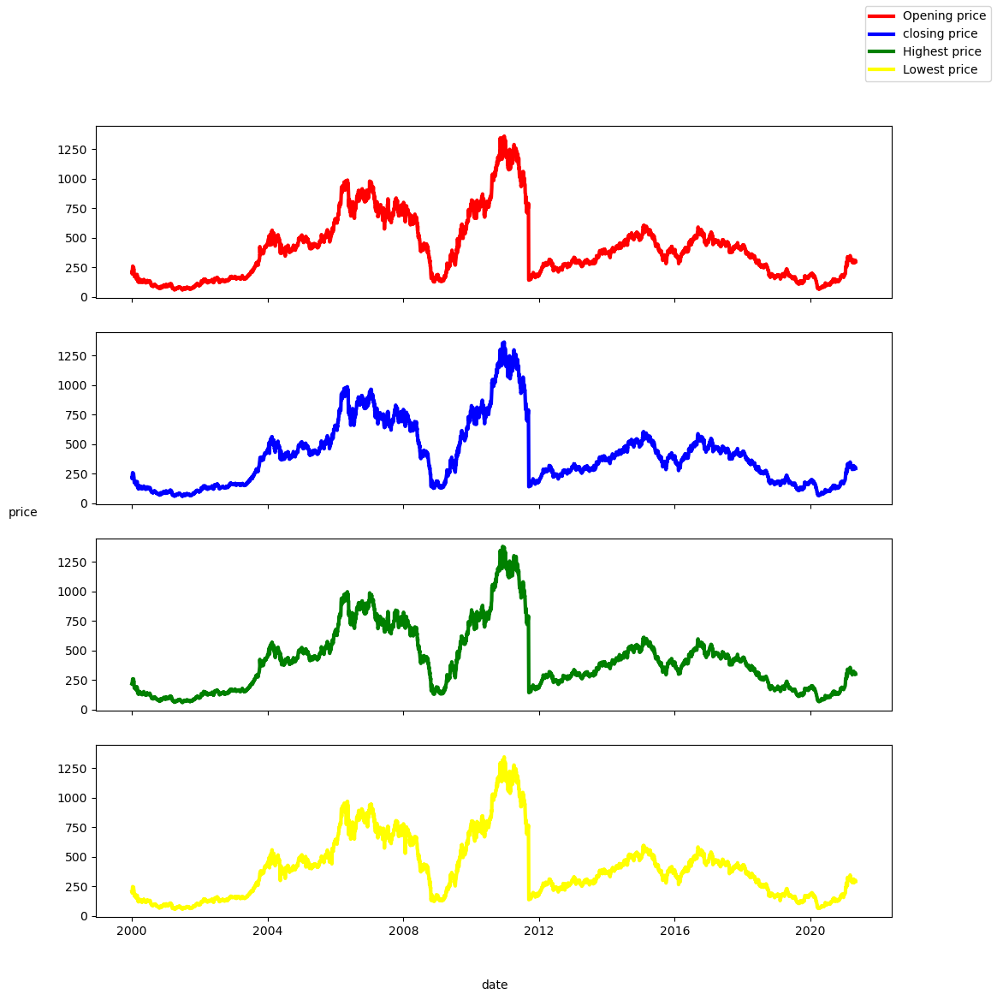

LINE CHART 

points will be connected by line
show information that changes over time . eg: stock trend , sles trend , user subscription/enrollment,reveue trend

Import libraries


```python
import matplotlib
import matplotlib.pyplot as plt
import numpy as np
import pandas as pd
```

Loas dataset


```python
stocks=pd.read_csv("TATAMOTORS.csv")
```


```python
stocks.head()
```


<div>
<style scoped>
    .dataframe tbody tr th:only-of-type {
        vertical-align: middle;
    }

    .dataframe tbody tr th {
        vertical-align: top;
    }

    .dataframe thead th {
        text-align: right;
    }
</style>
<table border="1" class="dataframe">
  <thead>
    <tr style="text-align: right;">
      <th></th>
      <th>Date</th>
      <th>Symbol</th>
      <th>Series</th>
      <th>Prev Close</th>
      <th>Open</th>
      <th>High</th>
      <th>Low</th>
      <th>Last</th>
      <th>Close</th>
      <th>VWAP</th>
      <th>Volume</th>
      <th>Turnover</th>
      <th>Trades</th>
      <th>Deliverable Volume</th>
      <th>%Deliverble</th>
    </tr>
  </thead>
  <tbody>
    <tr>
      <th>0</th>
      <td>2000-01-03</td>
      <td>TELCO</td>
      <td>EQ</td>
      <td>201.60</td>
      <td>207.4</td>
      <td>217.25</td>
      <td>207.4</td>
      <td>217.0</td>
      <td>216.75</td>
      <td>214.28</td>
      <td>676126</td>
      <td>1.448775e+13</td>
      <td>NaN</td>
      <td>NaN</td>
      <td>NaN</td>
    </tr>
    <tr>
      <th>1</th>
      <td>2000-01-04</td>
      <td>TELCO</td>
      <td>EQ</td>
      <td>216.75</td>
      <td>217.0</td>
      <td>219.00</td>
      <td>206.0</td>
      <td>211.9</td>
      <td>208.20</td>
      <td>209.50</td>
      <td>679215</td>
      <td>1.422962e+13</td>
      <td>NaN</td>
      <td>NaN</td>
      <td>NaN</td>
    </tr>
    <tr>
      <th>2</th>
      <td>2000-01-05</td>
      <td>TELCO</td>
      <td>EQ</td>
      <td>208.20</td>
      <td>194.0</td>
      <td>217.80</td>
      <td>194.0</td>
      <td>213.1</td>
      <td>213.25</td>
      <td>210.33</td>
      <td>1120951</td>
      <td>2.357684e+13</td>
      <td>NaN</td>
      <td>NaN</td>
      <td>NaN</td>
    </tr>
    <tr>
      <th>3</th>
      <td>2000-01-06</td>
      <td>TELCO</td>
      <td>EQ</td>
      <td>213.25</td>
      <td>215.0</td>
      <td>229.90</td>
      <td>215.0</td>
      <td>222.0</td>
      <td>222.10</td>
      <td>225.29</td>
      <td>1968998</td>
      <td>4.435932e+13</td>
      <td>NaN</td>
      <td>NaN</td>
      <td>NaN</td>
    </tr>
    <tr>
      <th>4</th>
      <td>2000-01-07</td>
      <td>TELCO</td>
      <td>EQ</td>
      <td>222.10</td>
      <td>224.0</td>
      <td>239.90</td>
      <td>223.1</td>
      <td>239.9</td>
      <td>239.90</td>
      <td>236.32</td>
      <td>2199431</td>
      <td>5.197636e+13</td>
      <td>NaN</td>
      <td>NaN</td>
      <td>NaN</td>
    </tr>
  </tbody>
</table>
</div>


```python
stocks.info()
```

    <class 'pandas.core.frame.DataFrame'>
    RangeIndex: 5306 entries, 0 to 5305
    Data columns (total 15 columns):
     #   Column              Non-Null Count  Dtype  
    ---  ------              --------------  -----  
     0   Date                5306 non-null   object 
     1   Symbol              5306 non-null   object 
     2   Series              5306 non-null   object 
     3   Prev Close          5306 non-null   float64
     4   Open                5306 non-null   float64
     5   High                5306 non-null   float64
     6   Low                 5306 non-null   float64
     7   Last                5306 non-null   float64
     8   Close               5306 non-null   float64
     9   VWAP                5306 non-null   float64
     10  Volume              5306 non-null   int64  
     11  Turnover            5306 non-null   float64
     12  Trades              2456 non-null   float64
     13  Deliverable Volume  4792 non-null   float64
     14  %Deliverble         4792 non-null   float64
    dtypes: float64(11), int64(1), object(3)
    memory usage: 621.9+ KB
    


Convert data type
1


```python
stocks["Date"]=pd.to_datetime(stocks["Date"],format="%Y-%m-%d")
```


```python
stocks.info()
```

    <class 'pandas.core.frame.DataFrame'>
    RangeIndex: 5306 entries, 0 to 5305
    Data columns (total 15 columns):
     #   Column              Non-Null Count  Dtype         
    ---  ------              --------------  -----         
     0   Date                5306 non-null   datetime64[ns]
     1   Symbol              5306 non-null   object        
     2   Series              5306 non-null   object        
     3   Prev Close          5306 non-null   float64       
     4   Open                5306 non-null   float64       
     5   High                5306 non-null   float64       
     6   Low                 5306 non-null   float64       
     7   Last                5306 non-null   float64       
     8   Close               5306 non-null   float64       
     9   VWAP                5306 non-null   float64       
     10  Volume              5306 non-null   int64         
     11  Turnover            5306 non-null   float64       
     12  Trades              2456 non-null   float64       
     13  Deliverable Volume  4792 non-null   float64       
     14  %Deliverble         4792 non-null   float64       
    dtypes: datetime64[ns](1), float64(11), int64(1), object(2)
    memory usage: 621.9+ KB
    


```python

```

SECTION 1: state based interface


```python

```

A)Line plot for opening price


```python
plt.figure(figsize=(12,8))
#build a single line plots in figure 
plt.plot(stocks['Date'],stocks[ 'Open'],label="Opening price")
plt.xlabel("Date")
plt.ylabel("Price")
plt.title("Stock price TATA")
plt.legend()
```


    <matplotlib.legend.Legend at 0x21f450ce8d0>


    

    


A)Line plot for opening price & closing price


```python
plt.figure(figsize=(12,8))

#build 2 line plots in figure 
plt.plot(stocks['Date'],stocks[ 'Open'],label="Opening price")
plt.plot(stocks['Date'],stocks[ 'Close'],label="Closing price")
plt.xlabel("Date")
plt.ylabel("Price")
plt.title("Stock price TATA")
plt.legend()
```


    <matplotlib.legend.Legend at 0x21f45107390>


    

    


Section 2: Object Oriented interface


```python

```

A ) Line plot for opening price


```python
fig,ax1=plt.subplots(1,1,figsize=(12,8))

ax1.plot(stocks['Date'],stocks[ 'Open'],label="Opening price",linestyle="-",linewidth="3",color="red")
ax1.set_xlabel("Date")
ax1.set_ylabel("Opening price")
fig.legend()
```


    <matplotlib.legend.Legend at 0x21f45bcf390>


    

    


B)Line plot for opening & closing price


```python

fig,ax1=plt.subplots(1,1,figsize=(12,8))

ax1.plot(stocks['Date'],stocks[ 'Open'],label="Opening price",linestyle="-",linewidth="3",color="red")

ax2=ax1.twinx()
ax2.plot(stocks['Date'],stocks[ 'Close'],label="closing price",linestyle="-",linewidth="3",color="blue")

ax1.set_xlabel("Date")
ax1.set_ylabel("Opening price")
ax2.set_ylabel("Closing price")
fig.legend()
```


    <matplotlib.legend.Legend at 0x21f45199390>


    

    


c)Line plot for opening&closing&High&Low  price


```python
fig,ax=plt.subplots(4,1,figsize=(12,12),sharex=True, sharey=True)

ax[0].plot(stocks['Date'],stocks[ 'Open'],label="Opening price",linestyle="-",linewidth="3",color="red")
ax[1].plot(stocks['Date'],stocks[ 'Close'],label="closing price",linestyle="-",linewidth="3",color="blue")
ax[2].plot(stocks['Date'],stocks[ 'High'],label="Highest price",linestyle="-",linewidth="3",color="green")
ax[3].plot(stocks['Date'],stocks[ 'Low'],label="Lowest price",linestyle="-",linewidth="3",color="yellow")


# Make common axis labels
fig.text(0.5, 0.04,'date') #x,y position to place the text
fig.text(0.04, 0.5,'price') #x,y position to place the text

fig.legend()
```


    <matplotlib.legend.Legend at 0x21f45267290>


    

    

