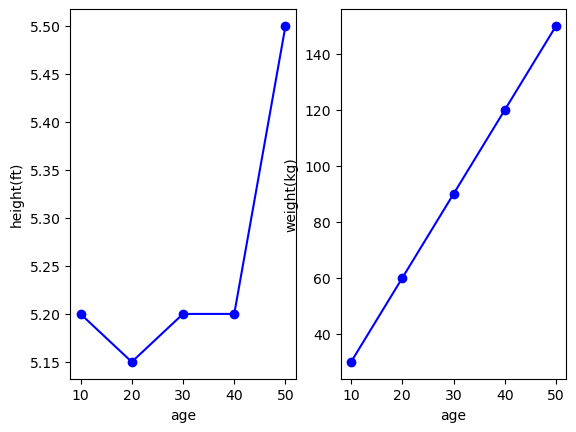

matplotlib_project

Import libraries


```python
import matplotlib.pyplot as plt
```

Part A : state-based interface(using pyplot)

Figure 1 : Empty figure plot


```python
fig=plt.figure()
plt.plot()
```


    []


    

    


Figure 2 : Figure With plot added single list of values to the plot property


```python
age=[10,20,30,40,50]
height_in_feet=[5.2,5.15,5.2,5.2,5.5]
weight_in_kg=[30,60,90,120,150]
```


```python
#create a figure and return a object
fig=plt.figure()
plt.plot(age,"bo-")
```


    [<matplotlib.lines.Line2D at 0x1f00134bc10>]


    

    


figure 3 : Age VS Height


```python
#create a figure and return a object
fig=plt.figure()
#line plot age vs height
plt.plot(age,height_in_feet,"bo-")
plt.xlabel("age")
plt.ylabel("height(ft)")

```


    Text(0, 0.5, 'height(ft)')


    

    


Figure 4 : Age VS Weight


```python
#create a figure and return a object
fig=plt.figure()
#line plot age vs height
plt.plot(age,weight_in_kg,"bo-")
plt.xlabel("age")
plt.ylabel("weight(kg)")
```


    Text(0, 0.5, 'weight(kg)')


    

    


Figure 5: Age VS Height and Weight


```python
#create a figure and return a object
fig=plt.figure()
#two line plots inside the same axes objects
plt.plot(height_in_feet,"bo-")
plt.plot(weight_in_kg,"go-")
plt.xlabel("age")
plt.ylabel("Height&weight")

```


    Text(0, 0.5, 'Height&weight')


    

    


Part B : Object - Oriented Interface

the matplotlib.pyplot


```python

```

Figure 1: Empty Figure plot 


```python
fig,ax=plt.subplots()
ax
```


    <Axes: >


    

    


Figure 2 : Figure with Plot added single list of values to the plot property


```python
fig,ax=plt.subplots()
ax.plot(age,"bo-")
```


    [<matplotlib.lines.Line2D at 0x1f0029e0810>]


    

    


Figure 3: Age VS height


```python
fig,ax=plt.subplots()
ax.plot(age,height_in_feet,"bo-")
ax.set_xlabel("age")
ax.set_ylabel("height(ft)")
```


    Text(0, 0.5, 'height(ft)')


    

    


Figure 4 : Age VS Weight


```python
fig,ax=plt.subplots()
ax.plot(age,weight_in_kg,"bo-")
ax.set_xlabel("age")
ax.set_ylabel("weight(kg)")
```


    Text(0, 0.5, 'weight(kg)')


    

    


Figure 5: Age VS Height and Weight

A) Stacking subplots in one direction


```python
fig,ax=plt.subplots(1,2)
#ax,ax[0],ax[1]

ax[0].plot(age,height_in_feet,"bo-")
ax[0].set_xlabel("age")
ax[0].set_ylabel("height(ft)")

ax[1].plot(age,weight_in_kg,"bo-")
ax[1].set_xlabel("age")
ax[1].set_ylabel("weight(kg)")
```


    Text(0, 0.5, 'weight(kg)')


    

    


B) Stacking subplots in one direction


```python
fig,ax=plt.subplots(2,1)
#ax,ax[0],ax[1]

ax[0].plot(age,height_in_feet,"bo-")
ax[0].set_xlabel("age")
ax[0].set_ylabel("height(ft)")

ax[1].plot(age,weight_in_kg,"go-")
ax[1].set_xlabel("age")
ax[1].set_ylabel("weight(kg)")
```


    Text(0, 0.5, 'weight(kg)')


    

    


C ) create multiple lines in the Same line chart with Different Y - axes for each line


```python
#axes-ax1
fig,ax1=plt.subplots()
ax1.plot(age,height_in_feet,"bo-")
ax1.set_xlabel("age")
ax1.set_ylabel("height(ft)")


#axes - ax2
ax2=ax1.twinx()
ax2.plot(age,weight_in_kg,"go-")
ax2.set_xlabel("age")
ax2.set_ylabel("weight(kg)")
```


    Text(0, 0.5, 'weight(kg)')


    

    

