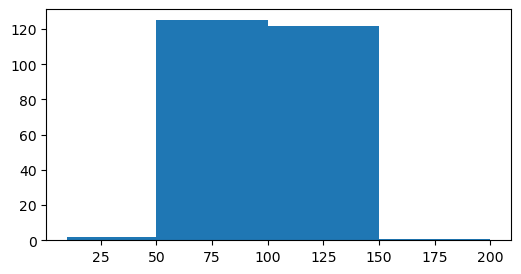

histogram

A histogram is a graph showing frequency distributions/counts of data falling within a certain interval/range.
Looks similar to bar graph but histogram groups data into buckets /Bins instead of plotting each value .
Height of the bar represents the frequency distributions/counts contained in that bin/range 

    
Histograms are approximate representations of the distribution of numeric data.Later it can be  converted into actual distributions using  kernel density estimation


```python

```

IMPORT LIBRARY 


```python
import matplotlib 
import matplotlib.pyplot as plt
import numpy as np
import pandas as pd
```

Simple histogram with custom bins


```python
weights = np.random.normal(100, 20, 250) #mean,SD,size
print(weights)
```

    [111.12352512  86.23504207 149.79866033  98.24179129 100.80591981
     105.53790301 105.40041185  90.6173004  104.40568821  91.88760482
     109.58613716  93.94907276 109.68050537  81.28140534  78.12147132
     119.62579393  99.26448209 153.16582506  68.1603293  115.92929597
     115.20300794 102.01768922 122.28114572  74.46866675 114.09651358
      69.20291183 108.54026154 116.7627953  100.14915463  68.78452008
     109.57113586  89.83318288  86.61079427 111.42530354  91.83237039
      86.07221102  91.11030925  77.32201707 108.38544534 103.78160947
      95.48544245  80.00961882  63.21106193 103.61564979  67.38317894
     138.28949047 132.65844425 112.9509495   97.47637976  91.69377617
     118.34930628  67.25473349  61.45692371  80.2441112   95.89061358
      89.21006678  48.33535219  71.48031986  79.35556541  93.95188751
      78.43714453 115.89931752  87.58729997  76.52264257 100.74120665
     102.47094867 115.41863202  78.46961855  83.48011898  84.58698501
     107.57910456  87.04396579  95.85196166  93.72161212  82.6733695
      80.82045942 107.2337919   82.46497385 111.45304931  83.11651838
     131.15483286 108.23696592 147.06675236  89.15557224  95.4249161
     123.59725053 109.11362533  74.28827243  87.29023755  98.59141427
     136.47291233 115.06515572  68.03398284 100.05185101  93.57285947
     133.23090251  97.47026725  90.41931832  67.10581372 108.46601352
     111.47298848 117.97898839  98.01688298 106.41024025  94.85935022
     126.91884687  96.08561983  69.3693677   91.20912139 102.87237052
      91.86209931 113.51412899  80.6051331   87.99957857  64.4208222
     117.47191077  84.18920257 102.61018971 100.91927758 120.23939779
      97.19540919 124.08474298  98.14584916 101.74768114  78.85229655
      82.3918734  120.73281394 119.16312792  70.37152828  66.79418539
      91.75317073 112.91285643 108.35235554 114.91836277 101.58784224
     100.95767902  81.61142745 115.10799353  92.27990006  92.5490657
      99.55411028  98.87908567 101.66075457  98.73827358 104.19528149
      88.40505445 108.07026375  89.28552523 121.48238851 124.990424
     110.79170009 127.57392841  89.04947582  91.71822498  92.04987305
      50.87268058  93.85315281 117.61288652 108.66501547  78.35931665
      92.25811483 116.25637266  98.67694875  98.97383103 127.05750665
      83.41164298 141.92019627 108.09495108 143.15551513 121.96720455
      73.92904468  97.24322797  95.21480088 114.43087561  72.89445747
      62.06073163 102.06826084  98.82954586 107.95054466 113.17031477
     100.28013921 117.25442977 111.36475004 119.43576565 142.34685916
     109.56989822  74.50703303  75.47399608 111.18290533  40.10286587
     121.5224299   67.32003708  92.36425962 108.22024197  82.17195165
     106.65280931 126.84827401 129.03480597  96.92930034 105.17734535
      81.15908034 115.91755808 106.70286709  99.43850574 141.52460696
     107.81907649 107.67300445  78.09300634  95.6310682   88.97752121
     117.21850789 107.02629459  60.0010389   94.34995732 106.67141158
      94.36955091  93.33488965 108.60844393 103.49088336  53.24115198
     120.0711092  144.75298538 124.64535198 128.55343222 141.72650585
     107.19238087  70.87406371  83.83561308  65.5060234  121.0952965
      91.16821509  93.48424955 106.49472125  78.51493673 116.95094824
     125.85197815 100.16056038  96.51629926  75.96563133  73.07332912
     108.44674261  80.81266434 120.82400784  88.87268385 106.66351963
     107.91067212  86.7629231  110.92637078 113.68328684  63.80494189]
    


```python
fig=plt.figure(figsize=(6,3))
plt.hist(weights)
```


    (array([ 3.,  4., 20., 33., 50., 54., 50., 22.,  7.,  7.]),
     array([ 40.10286587,  51.40916179,  62.71545771,  74.02175362,
             85.32804954,  96.63434546, 107.94064138, 119.2469373 ,
            130.55323322, 141.85952914, 153.16582506]),
     <BarContainer object of 10 artists>)


    

    


```python
fig,ax=plt.subplots()
ax.hist(weights)
```


    (array([ 3.,  4., 20., 33., 50., 54., 50., 22.,  7.,  7.]),
     array([ 40.10286587,  51.40916179,  62.71545771,  74.02175362,
             85.32804954,  96.63434546, 107.94064138, 119.2469373 ,
            130.55323322, 141.85952914, 153.16582506]),
     <BarContainer object of 10 artists>)


    

    


```python

fig=plt.figure(figsize=(6,3))
plt.hist(weights,bins=5)
```


    (array([  7.,  53., 104.,  72.,  14.]),
     array([ 40.10286587,  62.71545771,  85.32804954, 107.94064138,
            130.55323322, 153.16582506]),
     <BarContainer object of 5 artists>)


    

    


SIMPLE HISTOGRAM WITH CUSTOM RANGES INSTEAD OF BINS COUNT


```python
fig=plt.figure(figsize=(6,3))
plt.hist(weights,bins=[10,50,100,150,200])
```


    (array([  2., 125., 122.,   1.]),
     array([ 10.,  50., 100., 150., 200.]),
     <BarContainer object of 4 artists>)


    

    


LOAD DATASET


```python
customer_data=pd.read_csv("Ecommerce Customers.csv")
customer_data
```


<div>
<style scoped>
    .dataframe tbody tr th:only-of-type {
        vertical-align: middle;
    }

    .dataframe tbody tr th {
        vertical-align: top;
    }

    .dataframe thead th {
        text-align: right;
    }
</style>
<table border="1" class="dataframe">
  <thead>
    <tr style="text-align: right;">
      <th></th>
      <th>Email</th>
      <th>Address</th>
      <th>Avatar</th>
      <th>Avg. Session Length</th>
      <th>Time on App</th>
      <th>Time on Website</th>
      <th>Length of Membership</th>
      <th>Yearly Amount Spent</th>
    </tr>
  </thead>
  <tbody>
    <tr>
      <th>0</th>
      <td>mstephenson@fernandez.com</td>
      <td>835 Frank Tunnel\nWrightmouth, MI 82180-9605</td>
      <td>Violet</td>
      <td>34.497268</td>
      <td>12.655651</td>
      <td>39.577668</td>
      <td>4.082621</td>
      <td>587.951054</td>
    </tr>
    <tr>
      <th>1</th>
      <td>hduke@hotmail.com</td>
      <td>4547 Archer Common\nDiazchester, CA 06566-8576</td>
      <td>DarkGreen</td>
      <td>31.926272</td>
      <td>11.109461</td>
      <td>37.268959</td>
      <td>2.664034</td>
      <td>392.204933</td>
    </tr>
    <tr>
      <th>2</th>
      <td>pallen@yahoo.com</td>
      <td>24645 Valerie Unions Suite 582\nCobbborough, D...</td>
      <td>Bisque</td>
      <td>33.000915</td>
      <td>11.330278</td>
      <td>37.110597</td>
      <td>4.104543</td>
      <td>487.547505</td>
    </tr>
    <tr>
      <th>3</th>
      <td>riverarebecca@gmail.com</td>
      <td>1414 David Throughway\nPort Jason, OH 22070-1220</td>
      <td>SaddleBrown</td>
      <td>34.305557</td>
      <td>13.717514</td>
      <td>36.721283</td>
      <td>3.120179</td>
      <td>581.852344</td>
    </tr>
    <tr>
      <th>4</th>
      <td>mstephens@davidson-herman.com</td>
      <td>14023 Rodriguez Passage\nPort Jacobville, PR 3...</td>
      <td>MediumAquaMarine</td>
      <td>33.330673</td>
      <td>12.795189</td>
      <td>37.536653</td>
      <td>4.446308</td>
      <td>599.406092</td>
    </tr>
    <tr>
      <th>...</th>
      <td>...</td>
      <td>...</td>
      <td>...</td>
      <td>...</td>
      <td>...</td>
      <td>...</td>
      <td>...</td>
      <td>...</td>
    </tr>
    <tr>
      <th>495</th>
      <td>lewisjessica@craig-evans.com</td>
      <td>4483 Jones Motorway Suite 872\nLake Jamiefurt,...</td>
      <td>Tan</td>
      <td>33.237660</td>
      <td>13.566160</td>
      <td>36.417985</td>
      <td>3.746573</td>
      <td>573.847438</td>
    </tr>
    <tr>
      <th>496</th>
      <td>katrina56@gmail.com</td>
      <td>172 Owen Divide Suite 497\nWest Richard, CA 19320</td>
      <td>PaleVioletRed</td>
      <td>34.702529</td>
      <td>11.695736</td>
      <td>37.190268</td>
      <td>3.576526</td>
      <td>529.049004</td>
    </tr>
    <tr>
      <th>497</th>
      <td>dale88@hotmail.com</td>
      <td>0787 Andrews Ranch Apt. 633\nSouth Chadburgh, ...</td>
      <td>Cornsilk</td>
      <td>32.646777</td>
      <td>11.499409</td>
      <td>38.332576</td>
      <td>4.958264</td>
      <td>551.620145</td>
    </tr>
    <tr>
      <th>498</th>
      <td>cwilson@hotmail.com</td>
      <td>680 Jennifer Lodge Apt. 808\nBrendachester, TX...</td>
      <td>Teal</td>
      <td>33.322501</td>
      <td>12.391423</td>
      <td>36.840086</td>
      <td>2.336485</td>
      <td>456.469510</td>
    </tr>
    <tr>
      <th>499</th>
      <td>hannahwilson@davidson.com</td>
      <td>49791 Rachel Heights Apt. 898\nEast Drewboroug...</td>
      <td>DarkMagenta</td>
      <td>33.715981</td>
      <td>12.418808</td>
      <td>35.771016</td>
      <td>2.735160</td>
      <td>497.778642</td>
    </tr>
  </tbody>
</table>
<p>500 rows × 8 columns</p>
</div>


```python
plt.figure(figsize=(15,5))
plt.xlabel("Avg. Session Length" )
plt.ylabel("Avg. Session frequency count")
plt.hist(customer_data["Avg. Session Length"],edgecolor="Black")
```


    (array([  1.,   6.,  19.,  67., 117., 117., 103.,  57.,   8.,   5.]),
     array([29.53242897, 30.19315232, 30.85387567, 31.51459902, 32.17532238,
            32.83604573, 33.49676908, 34.15749243, 34.81821578, 35.47893914,
            36.13966249]),
     <BarContainer object of 10 artists>)


    

    


CUSTOMIZE


```python
plt.figure(figsize=(15,5))
plt.xlabel("Avg. Session Length" )
plt.ylabel("Avg. Session frequency count")
plt.hist(customer_data["Avg. Session Length"],edgecolor="Black",facecolor="red",bins=20)
```


    (array([ 1.,  0.,  2.,  4.,  8., 11., 26., 41., 62., 55., 56., 61., 64.,
            39., 33., 24.,  6.,  2.,  3.,  2.]),
     array([29.53242897, 29.86279064, 30.19315232, 30.523514  , 30.85387567,
            31.18423735, 31.51459902, 31.8449607 , 32.17532238, 32.50568405,
            32.83604573, 33.1664074 , 33.49676908, 33.82713076, 34.15749243,
            34.48785411, 34.81821578, 35.14857746, 35.47893914, 35.80930081,
            36.13966249]),
     <BarContainer object of 20 artists>)


    

    


```python
plt.figure(figsize=(15,5))
plt.xlabel("Avg. Session frequency count" )
plt.ylabel("Avg. Session Length")
plt.hist(customer_data["Avg. Session Length"],edgecolor="Black",facecolor="red",bins=20,orientation="horizontal")
```


    (array([ 1.,  0.,  2.,  4.,  8., 11., 26., 41., 62., 55., 56., 61., 64.,
            39., 33., 24.,  6.,  2.,  3.,  2.]),
     array([29.53242897, 29.86279064, 30.19315232, 30.523514  , 30.85387567,
            31.18423735, 31.51459902, 31.8449607 , 32.17532238, 32.50568405,
            32.83604573, 33.1664074 , 33.49676908, 33.82713076, 34.15749243,
            34.48785411, 34.81821578, 35.14857746, 35.47893914, 35.80930081,
            36.13966249]),
     <BarContainer object of 20 artists>)


    

    


```python
plt.figure(figsize=(15,5))
plt.hist(customer_data["Avg. Session Length"],facecolor="red",edgecolor="Black",bins=20,histtype="step")
```


    (array([ 1.,  0.,  2.,  4.,  8., 11., 26., 41., 62., 55., 56., 61., 64.,
            39., 33., 24.,  6.,  2.,  3.,  2.]),
     array([29.53242897, 29.86279064, 30.19315232, 30.523514  , 30.85387567,
            31.18423735, 31.51459902, 31.8449607 , 32.17532238, 32.50568405,
            32.83604573, 33.1664074 , 33.49676908, 33.82713076, 34.15749243,
            34.48785411, 34.81821578, 35.14857746, 35.47893914, 35.80930081,
            36.13966249]),
     [<matplotlib.patches.Polygon at 0x25f75722910>])


    

    


DENSITY

y axis will not show frequency count isntead it shows PROBABILITY DENSITY OF EACH RANGE IN X-AXIS 
probablity of the plotted varible average session lenght lying within a particular range 


```python
plt.figure(figsize=(15,5))
plt.hist(customer_data["Avg. Session Length"],facecolor="red",edgecolor="Black",bins=20,density=True)
```


    (array([0.00605397, 0.        , 0.01210794, 0.02421588, 0.04843177,
            0.06659368, 0.15740325, 0.24821281, 0.3753462 , 0.3329684 ,
            0.33902237, 0.36929223, 0.38745414, 0.23610487, 0.19978104,
            0.1452953 , 0.03632383, 0.01210794, 0.01816191, 0.01210794]),
     array([29.53242897, 29.86279064, 30.19315232, 30.523514  , 30.85387567,
            31.18423735, 31.51459902, 31.8449607 , 32.17532238, 32.50568405,
            32.83604573, 33.1664074 , 33.49676908, 33.82713076, 34.15749243,
            34.48785411, 34.81821578, 35.14857746, 35.47893914, 35.80930081,
            36.13966249]),
     <BarContainer object of 20 artists>)


    

    


```python

```

CUMMULATIVE -FREQUENCY COUNT

Histogram bars will increase in height from left to right 

Hight of each bar represents sum of (no of values in that bin/range + sum of values in all other bins/ranges to left)


```python
plt.figure(figsize=(15,5))
plt.hist(customer_data["Avg. Session Length"],facecolor="red",edgecolor="Black",bins=20,cumulative=True)
```


    (array([  1.,   1.,   3.,   7.,  15.,  26.,  52.,  93., 155., 210., 266.,
            327., 391., 430., 463., 487., 493., 495., 498., 500.]),
     array([29.53242897, 29.86279064, 30.19315232, 30.523514  , 30.85387567,
            31.18423735, 31.51459902, 31.8449607 , 32.17532238, 32.50568405,
            32.83604573, 33.1664074 , 33.49676908, 33.82713076, 34.15749243,
            34.48785411, 34.81821578, 35.14857746, 35.47893914, 35.80930081,
            36.13966249]),
     <BarContainer object of 20 artists>)


    

    


CUMMULATIVE DENSITY

Histogram bars will increase in height from left to right

height of each bar gives us the cumulative probability of the corresponding x value i.e the probability that the value of x is, at or below the corresponding value.
y aixs values range from 0-1 represent prbalbity  and not  frequency
as we move to right the value increases 


```python
plt.figure(figsize=(15,5))
plt.hist(customer_data["Avg. Session Length"],facecolor="red",edgecolor="Black",bins=20,cumulative=True,density=True)
```


    (array([0.002, 0.002, 0.006, 0.014, 0.03 , 0.052, 0.104, 0.186, 0.31 ,
            0.42 , 0.532, 0.654, 0.782, 0.86 , 0.926, 0.974, 0.986, 0.99 ,
            0.996, 1.   ]),
     array([29.53242897, 29.86279064, 30.19315232, 30.523514  , 30.85387567,
            31.18423735, 31.51459902, 31.8449607 , 32.17532238, 32.50568405,
            32.83604573, 33.1664074 , 33.49676908, 33.82713076, 34.15749243,
            34.48785411, 34.81821578, 35.14857746, 35.47893914, 35.80930081,
            36.13966249]),
     <BarContainer object of 20 artists>)


    

    

