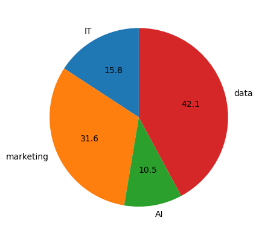
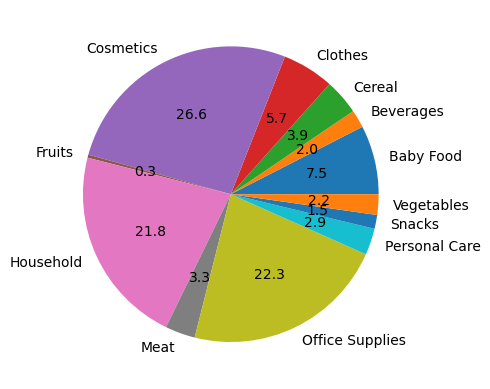
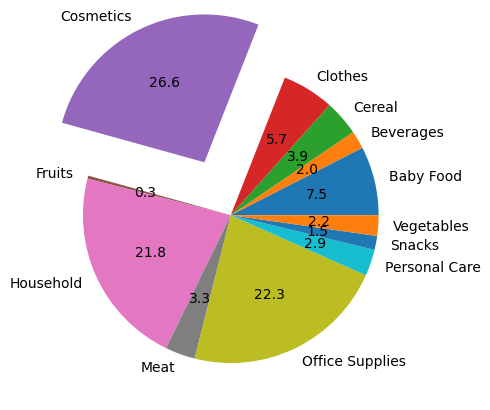

PIE CHART

Import Libraries


```python
import matplotlib 
import matplotlib.pyplot as plt
import numpy as np
import pandas as pd
```


```python
quantity_sold = [150, 300, 100, 400]
employee= ["IT","marketing","AI","data"]
```


```python
fig,ax=plt.subplots()
ax.pie(quantity_sold,labels=employee,autopct="%1.1f",startangle=90)
```


    ([<matplotlib.patches.Wedge at 0x285a3eeb050>,
      <matplotlib.patches.Wedge at 0x285a3efcb50>,
      <matplotlib.patches.Wedge at 0x285a3efe990>,
      <matplotlib.patches.Wedge at 0x285a3efe090>],
     [Text(-0.5235421132720431, 0.9674211366466227, 'IT'),
      Text(-1.0073506941587782, -0.4418648876951279, 'marketing'),
      Text(0.18105392366445877, -1.0849974547093206, 'AI'),
      Text(1.0663403204769755, 0.2700339255076324, 'data')],
     [Text(-0.2855684254211144, 0.5276842563527032, '15.8'),
      Text(-0.5494640149956971, -0.24101721147006971, '31.6'),
      Text(0.09875668563515931, -0.5918167934778112, '10.5'),
      Text(0.5816401748056229, 0.1472912320950722, '42.1')])


    

    


simple Pie Chart


```python
sales=pd.read_csv("100 Sales Records.csv")
sales
```


<div>
<style scoped>
    .dataframe tbody tr th:only-of-type {
        vertical-align: middle;
    }

    .dataframe tbody tr th {
        vertical-align: top;
    }

    .dataframe thead th {
        text-align: right;
    }
</style>
<table border="1" class="dataframe">
  <thead>
    <tr style="text-align: right;">
      <th></th>
      <th>Region</th>
      <th>Country</th>
      <th>Item Type</th>
      <th>Sales Channel</th>
      <th>Order Priority</th>
      <th>Order Date</th>
      <th>Order ID</th>
      <th>Ship Date</th>
      <th>Units Sold</th>
      <th>Unit Price</th>
      <th>Unit Cost</th>
      <th>Total Revenue</th>
      <th>Total Cost</th>
      <th>Total Profit</th>
    </tr>
  </thead>
  <tbody>
    <tr>
      <th>0</th>
      <td>Australia and Oceania</td>
      <td>Tuvalu</td>
      <td>Baby Food</td>
      <td>Offline</td>
      <td>H</td>
      <td>5/28/2010</td>
      <td>669165933</td>
      <td>6/27/2010</td>
      <td>9925</td>
      <td>255.28</td>
      <td>159.42</td>
      <td>2533654.00</td>
      <td>1582243.50</td>
      <td>951410.50</td>
    </tr>
    <tr>
      <th>1</th>
      <td>Central America and the Caribbean</td>
      <td>Grenada</td>
      <td>Cereal</td>
      <td>Online</td>
      <td>C</td>
      <td>8/22/2012</td>
      <td>963881480</td>
      <td>9/15/2012</td>
      <td>2804</td>
      <td>205.70</td>
      <td>117.11</td>
      <td>576782.80</td>
      <td>328376.44</td>
      <td>248406.36</td>
    </tr>
    <tr>
      <th>2</th>
      <td>Europe</td>
      <td>Russia</td>
      <td>Office Supplies</td>
      <td>Offline</td>
      <td>L</td>
      <td>5/2/2014</td>
      <td>341417157</td>
      <td>5/8/2014</td>
      <td>1779</td>
      <td>651.21</td>
      <td>524.96</td>
      <td>1158502.59</td>
      <td>933903.84</td>
      <td>224598.75</td>
    </tr>
    <tr>
      <th>3</th>
      <td>Sub-Saharan Africa</td>
      <td>Sao Tome and Principe</td>
      <td>Fruits</td>
      <td>Online</td>
      <td>C</td>
      <td>6/20/2014</td>
      <td>514321792</td>
      <td>7/5/2014</td>
      <td>8102</td>
      <td>9.33</td>
      <td>6.92</td>
      <td>75591.66</td>
      <td>56065.84</td>
      <td>19525.82</td>
    </tr>
    <tr>
      <th>4</th>
      <td>Sub-Saharan Africa</td>
      <td>Rwanda</td>
      <td>Office Supplies</td>
      <td>Offline</td>
      <td>L</td>
      <td>2/1/2013</td>
      <td>115456712</td>
      <td>2/6/2013</td>
      <td>5062</td>
      <td>651.21</td>
      <td>524.96</td>
      <td>3296425.02</td>
      <td>2657347.52</td>
      <td>639077.50</td>
    </tr>
    <tr>
      <th>...</th>
      <td>...</td>
      <td>...</td>
      <td>...</td>
      <td>...</td>
      <td>...</td>
      <td>...</td>
      <td>...</td>
      <td>...</td>
      <td>...</td>
      <td>...</td>
      <td>...</td>
      <td>...</td>
      <td>...</td>
      <td>...</td>
    </tr>
    <tr>
      <th>95</th>
      <td>Sub-Saharan Africa</td>
      <td>Mali</td>
      <td>Clothes</td>
      <td>Online</td>
      <td>M</td>
      <td>7/26/2011</td>
      <td>512878119</td>
      <td>9/3/2011</td>
      <td>888</td>
      <td>109.28</td>
      <td>35.84</td>
      <td>97040.64</td>
      <td>31825.92</td>
      <td>65214.72</td>
    </tr>
    <tr>
      <th>96</th>
      <td>Asia</td>
      <td>Malaysia</td>
      <td>Fruits</td>
      <td>Offline</td>
      <td>L</td>
      <td>11/11/2011</td>
      <td>810711038</td>
      <td>12/28/2011</td>
      <td>6267</td>
      <td>9.33</td>
      <td>6.92</td>
      <td>58471.11</td>
      <td>43367.64</td>
      <td>15103.47</td>
    </tr>
    <tr>
      <th>97</th>
      <td>Sub-Saharan Africa</td>
      <td>Sierra Leone</td>
      <td>Vegetables</td>
      <td>Offline</td>
      <td>C</td>
      <td>6/1/2016</td>
      <td>728815257</td>
      <td>6/29/2016</td>
      <td>1485</td>
      <td>154.06</td>
      <td>90.93</td>
      <td>228779.10</td>
      <td>135031.05</td>
      <td>93748.05</td>
    </tr>
    <tr>
      <th>98</th>
      <td>North America</td>
      <td>Mexico</td>
      <td>Personal Care</td>
      <td>Offline</td>
      <td>M</td>
      <td>7/30/2015</td>
      <td>559427106</td>
      <td>8/8/2015</td>
      <td>5767</td>
      <td>81.73</td>
      <td>56.67</td>
      <td>471336.91</td>
      <td>326815.89</td>
      <td>144521.02</td>
    </tr>
    <tr>
      <th>99</th>
      <td>Sub-Saharan Africa</td>
      <td>Mozambique</td>
      <td>Household</td>
      <td>Offline</td>
      <td>L</td>
      <td>2/10/2012</td>
      <td>665095412</td>
      <td>2/15/2012</td>
      <td>5367</td>
      <td>668.27</td>
      <td>502.54</td>
      <td>3586605.09</td>
      <td>2697132.18</td>
      <td>889472.91</td>
    </tr>
  </tbody>
</table>
<p>100 rows × 14 columns</p>
</div>


```python
item_Type_sales=sales.groupby("Item Type").sum()
item_Type_sales

```


<div>
<style scoped>
    .dataframe tbody tr th:only-of-type {
        vertical-align: middle;
    }

    .dataframe tbody tr th {
        vertical-align: top;
    }

    .dataframe thead th {
        text-align: right;
    }
</style>
<table border="1" class="dataframe">
  <thead>
    <tr style="text-align: right;">
      <th></th>
      <th>Region</th>
      <th>Country</th>
      <th>Sales Channel</th>
      <th>Order Priority</th>
      <th>Order Date</th>
      <th>Order ID</th>
      <th>Ship Date</th>
      <th>Units Sold</th>
      <th>Unit Price</th>
      <th>Unit Cost</th>
      <th>Total Revenue</th>
      <th>Total Cost</th>
      <th>Total Profit</th>
    </tr>
    <tr>
      <th>Item Type</th>
      <th></th>
      <th></th>
      <th></th>
      <th></th>
      <th></th>
      <th></th>
      <th></th>
      <th></th>
      <th></th>
      <th></th>
      <th></th>
      <th></th>
      <th></th>
    </tr>
  </thead>
  <tbody>
    <tr>
      <th>Baby Food</th>
      <td>Australia and OceaniaAustralia and OceaniaEuro...</td>
      <td>TuvaluSolomon IslandsNorwayPortugalSan MarinoM...</td>
      <td>OfflineOnlineOnlineOnlineOnlineOfflineOffline</td>
      <td>HCLHLHM</td>
      <td>5/28/20102/4/20155/14/20147/31/20156/26/20135/...</td>
      <td>4649561463</td>
      <td>6/27/20102/21/20156/28/20149/3/20157/1/20136/2...</td>
      <td>40545</td>
      <td>1786.96</td>
      <td>1115.94</td>
      <td>10350327.60</td>
      <td>6463683.90</td>
      <td>3886643.70</td>
    </tr>
    <tr>
      <th>Beverages</th>
      <td>Sub-Saharan AfricaEuropeSub-Saharan AfricaAust...</td>
      <td>CameroonNorwayDemocratic Republic of the Congo...</td>
      <td>OfflineOfflineOnlineOnlineOfflineOfflineOfflin...</td>
      <td>CCCCCCHC</td>
      <td>4/1/20157/18/20145/26/201110/28/20141/16/20111...</td>
      <td>3488436455</td>
      <td>4/18/20157/30/20147/15/201111/15/20141/21/2011...</td>
      <td>56708</td>
      <td>379.60</td>
      <td>254.32</td>
      <td>2690794.60</td>
      <td>1802747.32</td>
      <td>888047.28</td>
    </tr>
    <tr>
      <th>Cereal</th>
      <td>Central America and the CaribbeanSub-Saharan A...</td>
      <td>GrenadaSenegalThe GambiaComorosSaudi ArabiaAus...</td>
      <td>OnlineOnlineOfflineOfflineOnlineOfflineOnline</td>
      <td>CHHHMHH</td>
      <td>8/22/20124/18/20146/7/20123/29/20163/25/20136/...</td>
      <td>5327696855</td>
      <td>9/15/20125/30/20146/8/20124/29/20163/28/20137/...</td>
      <td>25877</td>
      <td>1439.90</td>
      <td>819.77</td>
      <td>5322898.90</td>
      <td>3030455.47</td>
      <td>2292443.43</td>
    </tr>
    <tr>
      <th>Clothes</th>
      <td>Sub-Saharan AfricaAsiaEuropeAsiaEuropeEuropeSu...</td>
      <td>Cape VerdeBangladeshBulgariaMyanmarMacedoniaAl...</td>
      <td>OfflineOnlineOnlineOnlineOfflineOnlineOnlineOf...</td>
      <td>HLMHCCCCHMLLM</td>
      <td>8/2/20141/13/20174/23/201211/14/201510/14/2014...</td>
      <td>7557276802</td>
      <td>8/19/20143/1/20176/3/201211/18/201511/14/20143...</td>
      <td>71260</td>
      <td>1420.64</td>
      <td>465.92</td>
      <td>7787292.80</td>
      <td>2553958.40</td>
      <td>5233334.40</td>
    </tr>
    <tr>
      <th>Cosmetics</th>
      <td>AsiaEuropeEuropeMiddle East and North AfricaEu...</td>
      <td>Sri LankaFranceSwitzerlandAzerbaijanIcelandAus...</td>
      <td>OfflineOnlineOfflineOnlineOnlineOfflineOffline...</td>
      <td>MHMMCHHHHLHHH</td>
      <td>11/19/20165/22/20179/17/20122/6/201012/31/2016...</td>
      <td>6463416606</td>
      <td>12/18/20166/5/201710/20/20122/25/201012/31/201...</td>
      <td>83718</td>
      <td>5683.60</td>
      <td>3423.29</td>
      <td>36601509.60</td>
      <td>22045460.94</td>
      <td>14556048.66</td>
    </tr>
    <tr>
      <th>Fruits</th>
      <td>Sub-Saharan AfricaAustralia and OceaniaAustral...</td>
      <td>Sao Tome and PrincipeNew ZealandKiribatiMaliSy...</td>
      <td>OnlineOnlineOnlineOnlineOnlineOnlineOfflineOnl...</td>
      <td>CHMLLLHLML</td>
      <td>6/20/20149/8/201410/13/20145/7/201011/22/20118...</td>
      <td>5419570846</td>
      <td>7/5/201410/4/201411/10/20145/10/201012/3/20119...</td>
      <td>49998</td>
      <td>93.30</td>
      <td>69.20</td>
      <td>466481.34</td>
      <td>345986.16</td>
      <td>120495.18</td>
    </tr>
    <tr>
      <th>Household</th>
      <td>Sub-Saharan AfricaCentral America and the Cari...</td>
      <td>AngolaHondurasTurkmenistanThe GambiaMyanmarUni...</td>
      <td>OfflineOfflineOfflineOfflineOfflineOnlineOffli...</td>
      <td>MHLLHLCLL</td>
      <td>4/23/20112/8/201712/30/20105/26/20121/16/20151...</td>
      <td>4984468632</td>
      <td>4/27/20112/13/20171/20/20116/9/20123/1/20152/1...</td>
      <td>44727</td>
      <td>6014.43</td>
      <td>4522.86</td>
      <td>29889712.29</td>
      <td>22477106.58</td>
      <td>7412605.71</td>
    </tr>
    <tr>
      <th>Meat</th>
      <td>Australia and OceaniaSub-Saharan Africa</td>
      <td>East TimorThe Gambia</td>
      <td>OnlineOnline</td>
      <td>LM</td>
      <td>7/31/20121/14/2017</td>
      <td>1147372316</td>
      <td>9/11/20121/23/2017</td>
      <td>10675</td>
      <td>843.78</td>
      <td>729.38</td>
      <td>4503675.75</td>
      <td>3893065.75</td>
      <td>610610.00</td>
    </tr>
    <tr>
      <th>Office Supplies</th>
      <td>EuropeSub-Saharan AfricaAustralia and OceaniaA...</td>
      <td>RussiaRwandaAustraliaBruneiBulgariaMauritaniaS...</td>
      <td>OfflineOfflineOnlineOnlineOnlineOfflineOffline...</td>
      <td>LLCLMCMMHMHM</td>
      <td>5/2/20142/1/201310/27/20154/1/20122/16/20121/1...</td>
      <td>4256053154</td>
      <td>5/8/20142/6/201311/25/20155/8/20122/28/20121/1...</td>
      <td>46967</td>
      <td>7814.52</td>
      <td>6299.52</td>
      <td>30585380.07</td>
      <td>24655796.32</td>
      <td>5929583.75</td>
    </tr>
    <tr>
      <th>Personal Care</th>
      <td>Sub-Saharan AfricaAsiaEuropeSub-Saharan Africa...</td>
      <td>Republic of the CongoMongoliaMoldova South Sud...</td>
      <td>OfflineOfflineOnlineOfflineOfflineOnlineOnline...</td>
      <td>MCLCLHMLLM</td>
      <td>7/14/20152/19/20145/7/201612/29/20135/8/20173/...</td>
      <td>5742522973</td>
      <td>8/25/20152/23/20145/10/20161/28/20145/21/20173...</td>
      <td>48708</td>
      <td>817.30</td>
      <td>566.70</td>
      <td>3980904.84</td>
      <td>2760282.36</td>
      <td>1220622.48</td>
    </tr>
    <tr>
      <th>Snacks</th>
      <td>Central America and the CaribbeanSub-Saharan A...</td>
      <td>HondurasDjiboutiZambia</td>
      <td>OnlineOnlineOnline</td>
      <td>LML</td>
      <td>6/30/20162/25/20171/4/2011</td>
      <td>1674348985</td>
      <td>7/26/20162/25/20171/5/2011</td>
      <td>13637</td>
      <td>457.74</td>
      <td>292.32</td>
      <td>2080733.46</td>
      <td>1328789.28</td>
      <td>751944.18</td>
    </tr>
    <tr>
      <th>Vegetables</th>
      <td>Sub-Saharan AfricaAsiaEuropeAsiaSub-Saharan Af...</td>
      <td>Burkina FasoKyrgyzstanSlovakiaLaosKenyaSierra ...</td>
      <td>OnlineOnlineOnlineOfflineOnlineOffline</td>
      <td>HHHCLC</td>
      <td>7/17/20126/24/201110/6/20129/15/20113/18/20126...</td>
      <td>4791316149</td>
      <td>7/27/20127/12/201111/10/201210/23/20114/7/2012...</td>
      <td>20051</td>
      <td>924.36</td>
      <td>545.58</td>
      <td>3089057.06</td>
      <td>1823237.43</td>
      <td>1265819.63</td>
    </tr>
  </tbody>
</table>
</div>


PIE CHART ITEM_TYPE


```python
fig,ax=plt.subplots()
ax.pie(item_Type_sales["Total Revenue"],
       labels=["Baby Food","Beverages","Cereal","Clothes","Cosmetics","Fruits","Household","Meat","Office Supplies","Personal Care","Snacks","Vegetables"],
        autopct="%1.1f")


    
```


    ([<matplotlib.patches.Wedge at 0x285a3f7fd90>,
      <matplotlib.patches.Wedge at 0x285a3f89590>,
      <matplotlib.patches.Wedge at 0x285a465ddd0>,
      <matplotlib.patches.Wedge at 0x285a465d9d0>,
      <matplotlib.patches.Wedge at 0x285a46548d0>,
      <matplotlib.patches.Wedge at 0x285a46568d0>,
      <matplotlib.patches.Wedge at 0x285a3f73550>,
      <matplotlib.patches.Wedge at 0x285a3f15c90>,
      <matplotlib.patches.Wedge at 0x285a3f0eb10>,
      <matplotlib.patches.Wedge at 0x285a4657250>,
      <matplotlib.patches.Wedge at 0x285a47b8f90>,
      <matplotlib.patches.Wedge at 0x285a47bab50>],
     [Text(1.069317424196168, 0.2579927253053317, 'Baby Food'),
      Text(0.946275789897917, 0.560858386273285, 'Beverages'),
      Text(0.8281941211306465, 0.7239437117101275, 'Cereal'),
      Text(0.577385022205347, 0.9362833631614582, 'Clothes'),
      Text(-0.49101964851746255, 0.984327031412725, 'Cosmetics'),
      Text(-1.0629671052274816, 0.28302108261454356, 'Fruits'),
      Text(-0.9979637688208339, -0.46267517344344, 'Household'),
      Text(-0.37717820016934694, -1.0333134109828501, 'Meat'),
      Text(0.4810404817086078, -0.989242161938901, 'Office Supplies'),
      Text(1.041515603496266, -0.3539000532266262, 'Personal Care'),
      Text(1.0804315454306173, -0.20656155411501034, 'Snacks'),
      Text(1.0972554266038428, -0.07765647937177513, 'Vegetables')],
     [Text(0.5832640495615462, 0.1407233047119991, '7.5'),
      Text(0.5161504308534093, 0.3059227561490645, '2.0'),
      Text(0.4517422478894435, 0.39487838820552407, '3.9'),
      Text(0.31493728483928013, 0.5107000162698863, '5.7'),
      Text(-0.2678288991913432, 0.5369056534978499, '26.6'),
      Text(-0.5798002392149899, 0.15437513597156918, '0.3'),
      Text(-0.544343873902273, -0.2523682764236945, '21.8'),
      Text(-0.20573356372873466, -0.5636254968997363, '3.3'),
      Text(0.2623857172956042, -0.539586633784855, '22.3'),
      Text(0.5680994200888723, -0.19303639266906883, '2.9'),
      Text(0.5893262975076093, -0.11266993860818744, '1.5'),
      Text(0.5985029599657324, -0.04235807965733188, '2.2')])


    

    


```python
fig,ax=plt.subplots()
ax.pie(item_Type_sales["Total Revenue"],
       labels=["Baby Food","Beverages","Cereal","Clothes","Cosmetics","Fruits","Household","Meat","Office Supplies","Personal Care","Snacks","Vegetables"],
        autopct="%1.1f",
        explode=(0,0,0,0,0.4,0,0,0,0,0,0,0))
```


    ([<matplotlib.patches.Wedge at 0x285a7322710>,
      <matplotlib.patches.Wedge at 0x285a7379690>,
      <matplotlib.patches.Wedge at 0x285a737ad90>,
      <matplotlib.patches.Wedge at 0x285a737a650>,
      <matplotlib.patches.Wedge at 0x285a7389b90>,
      <matplotlib.patches.Wedge at 0x285a738b610>,
      <matplotlib.patches.Wedge at 0x285a7398b90>,
      <matplotlib.patches.Wedge at 0x285a739a210>,
      <matplotlib.patches.Wedge at 0x285a739b7d0>,
      <matplotlib.patches.Wedge at 0x285a738b410>,
      <matplotlib.patches.Wedge at 0x285a73ae390>,
      <matplotlib.patches.Wedge at 0x285a73afb50>],
     [Text(1.069317424196168, 0.2579927253053317, 'Baby Food'),
      Text(0.946275789897917, 0.560858386273285, 'Beverages'),
      Text(0.8281941211306465, 0.7239437117101275, 'Cereal'),
      Text(0.577385022205347, 0.9362833631614582, 'Clothes'),
      Text(-0.669572247978358, 1.342264133744625, 'Cosmetics'),
      Text(-1.0629671052274816, 0.28302108261454356, 'Fruits'),
      Text(-0.9979637688208339, -0.46267517344344, 'Household'),
      Text(-0.37717820016934694, -1.0333134109828501, 'Meat'),
      Text(0.4810404817086078, -0.989242161938901, 'Office Supplies'),
      Text(1.041515603496266, -0.3539000532266262, 'Personal Care'),
      Text(1.0804315454306173, -0.20656155411501034, 'Snacks'),
      Text(1.0972554266038428, -0.07765647937177513, 'Vegetables')],
     [Text(0.5832640495615462, 0.1407233047119991, '7.5'),
      Text(0.5161504308534093, 0.3059227561490645, '2.0'),
      Text(0.4517422478894435, 0.39487838820552407, '3.9'),
      Text(0.31493728483928013, 0.5107000162698863, '5.7'),
      Text(-0.44638149865223864, 0.8948427558297499, '26.6'),
      Text(-0.5798002392149899, 0.15437513597156918, '0.3'),
      Text(-0.544343873902273, -0.2523682764236945, '21.8'),
      Text(-0.20573356372873466, -0.5636254968997363, '3.3'),
      Text(0.2623857172956042, -0.539586633784855, '22.3'),
      Text(0.5680994200888723, -0.19303639266906883, '2.9'),
      Text(0.5893262975076093, -0.11266993860818744, '1.5'),
      Text(0.5985029599657324, -0.04235807965733188, '2.2')])


    

    

